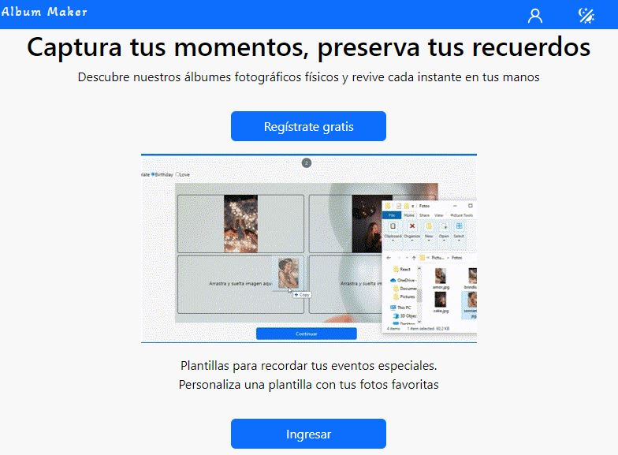
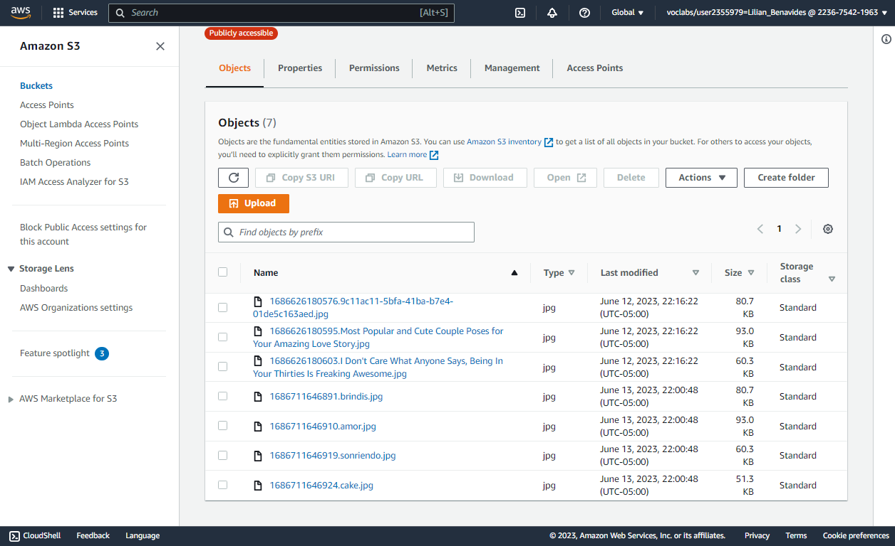

# AlbumMaker

## Decripción del Proyecto

AlbumMaker V5 es un desarrollo con control de calidad y seguridad de un proyecto frontEnd y Backend que permite cargar fotos y ordenar un álbum en línea.

Es un proyecto realizado como tarea para la materia Non-Relational database driven website dictada por el [Ing. Marco Calderon](https://www.linkedin.com/in/markoscalderon) y el [Ing. Leonardo Larrea](https://www.linkedin.com/in/leonardolarreadiaz) en el [Bootcamps FullStack Developer 2023](http://www.bootcamps.espol.edu.ec/) de la [Escuela Superior Politécnica del Litoral (ESPOL)](https://www.espol.edu.ec/).



### Funcionalidades

AlbumMaker cuenta con un sitio de Cliente y uno de Administración
Entre la funcionalidades encontramos:

:heavy_check_mark: `Registro de usuarios:` Cuenta con una opción para registrarse mediante el ingreso de sus datos nombre, correo y password.

:heavy_check_mark: `Login:` donde permite ingresar automaticamente como cliente, orerario o administrador, segun corresponda.

En el sitio de Cliente:

:heavy_check_mark: `Solicitar Album:` siguiendo el proceso de carga de imagenes, ingreso de datos de facturación y entrega y finalmente la confirmación de la orden.

:heavy_check_mark: `Listado de Ordenes:` donde el cliente puede revisar sus órdenes de álbumes solicitados y el estado actual.

:heavy_check_mark: `Edición de Ordenes:` si la orden se encuentra en estado "Enviada" el cliente puede hacer modificaciones.

En el sistio de Administración:

:heavy_check_mark: `Listado de Ordenes:` donde el operario y el administrador pueden revisar las órdenes realizadas por los clientes.

:heavy_check_mark: `Despacho de Ordenes:` donde el operario y el administrador podran asignar un courier.

:heavy_check_mark: `Cancelación de Ordenes:` donde el administrador podrá asignar el estado de la orden a "Cancelada" además colocar el motivo de la cancelación.

:heavy_check_mark: `Eliminación de Ordenes:` donde el administrador podrá borrar un orden para situaciones de informacion erróneas.

Api de órdenes:

:heavy_check_mark: `Consulta de Ordenes:` donde los couriers podrán listar las ordenes que se les han sido asignadas.

:heavy_check_mark: `Entregar/Devolver Ordenes:` donde los couriers podrán actualizar el estatus de las órdenes según corresponda.

## Desarrollo :: Detalles Técnicos

El presente proyecto se ha realizado con React en la parte de frontEnd y Node.js en la parte de backend.

Documentación de Tecnología utilizada:

[Javascript ](https://developer.mozilla.org/en-US/docs/Web/JavaScript/Reference)

[Bootstrap ](https://getbootstrap.esdocu.com/docs/5.1/getting-started/introduction/)

[React](https://es.react.dev/reference/react)

[React Redux](https://react-redux.js.org/)

[Mongoose] (https://mongoosejs.com/)

[Axios] (https://axios-http.com/docs/intro)

[Learner Lab de AWS Academy](https://awsacademy.instructure.com/)

Los datos se almacenarán de la siguiente manera:




## Despliegue :: Descargar y Ejecutar el Proyecto

**1. Crear el ambiente AWS que utilizará el proyecto**

* Base Mongo: Crear la base llamada AlbumMakerDB

* Repositorio S3: Crear bucket llamado albummaker con los siguientes permisos:
 
_Bucket Policy_
```
{
    "Version": "2012-10-17",
    "Statement": [
        {
            "Effect": "Allow",
            "Principal": "*",
            "Action": [
                "s3:GetObject",
                "s3:PutObject"
            ],
            "Resource": [
                "arn:aws:s3:::albummaker",
                "arn:aws:s3:::albummaker/*"
            ]
        }
    ]
}
```
_Cors_
 ```
 [
    {
        "AllowedHeaders": [
            "*"
        ],
        "AllowedMethods": [
            "PUT",
            "POST",
            "GET"
        ],
        "AllowedOrigins": [
            "*"
        ],
        "ExposeHeaders": [
            "ETag"
        ]
    }
]
 ```
 
2. Clonar el proyecto

 ```
 git clone https://github.com/liliantbo/albumMaker.node.mongo.git
 ```

3. Ir a la carpeta del proyecto

```
cd albumMaker.node.mongo
```

4. Instalar las dependencias

```
npm install
```
Este comando instalará de manera automática las librerias adicionales utilizadas en el proyecto: aws-sdk, react-bootstrap, redux, axios, entre otras.

5. Configurar las credenciales de conexion a AWS en SaveHandler.js

```
AWS.config.update({
    accessKeyId: '',
    secretAccessKey: '',
    region: '',
    sessionToken: ''
});


```
5. Iniciar el servidor de desarrollo local

```
node index.js
```

6. Abrir la aplicación desde el navegador

Abrir [http://localhost:3000](http://localhost:3000) para visualizar el proyecto.

## Desarrollado por:
 [<br><sub>Lilian Benavides</sub>](https://github.com/liliantbo)

